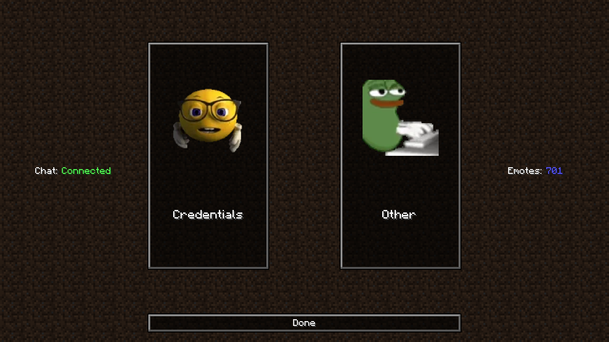
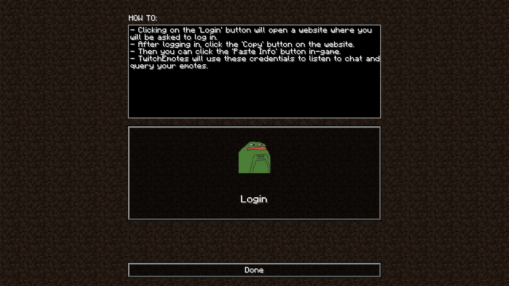
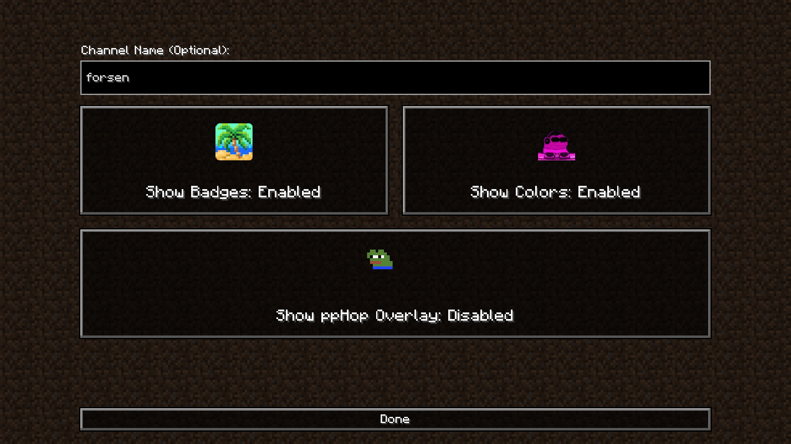
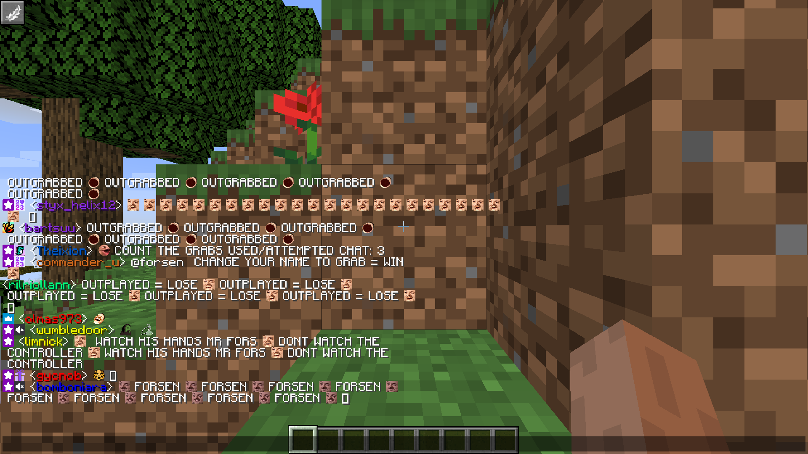

### [Consider supporting me on Ko-Fi!](https://ko-fi.com/quesia)

*These mods take a lot of time and effort to create and maintain. Any amount helps. :)*

### [Join my Discord server for more mods & tech-support!](https://discord.gg/s9m8gf6pju)

# TwitchEmotes

A Fabric mod that brings [Twitch](https://twitch.tv)'s emojis, [7TV](https://7tv.app) emotes, [BTTV](https://betterttv.com) emotes and [FFZ](https://frankerfacez.com) emotes to Minecraft! (Even the animated ones)

If you want the mod to be ported to a specific version, open an issue or ask me in [my Discord server](https://discord.gg/s9m8gf6pju)!

Config menu selection

Credentials config menu

Other config menu

In game

## Features:

- Rendering (animated) emotes from 7TV, BTTV and FFZ in Minecraft chat.
- Messages from Twitch chat in Minecraft chat.

## How to set it up:

1. [Download](https://github.com/faluhub/twitchemotes/releases/latest) and install the mod.
2. Launch the game and click the feather button in the top left.
3. Go to the 'Credentials' tab and follow the instructions.

## Credits:

- [Redstcne](https://twitch.tv/Redstcne) for suggesting the idea for the mod.
- [Gikkman/Java-Twirk](https://github.com/Gikkman/Java-Twirk) for the library that lets you connect to the Twitch chat.
- [giambaJ/jChat](https://github.com/giambaJ/jChat) for references for the emote platforms' APIs.
- [tduva/WebPDecoderJN](https://github.com/tduva/WebPDecoderJN) for making a working WebP decoder for Java.
- My awesome [Twitch](https://twitch.tv/faluhub) followers that helped me test this live!
